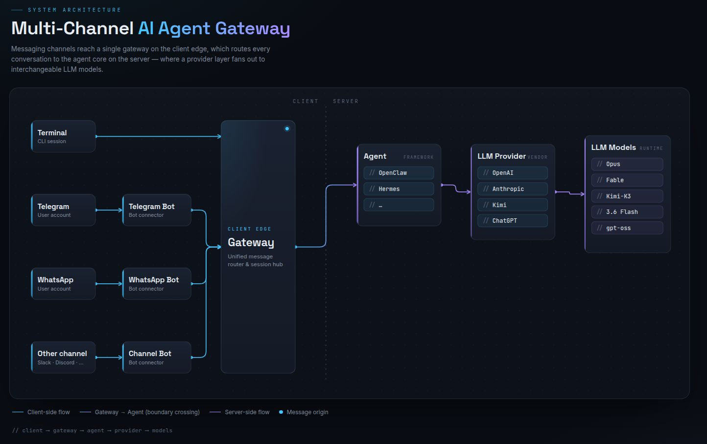

# Presence

**One agent, every surface.**

Most agents wait inside a chat window. Presence is a harness that gives a single agent a
presence in the places people already work — a terminal, Telegram, Slack, WhatsApp, a panel
inside an app — with one identity, one memory, and the ability to reach out first.

Built for *Agents, Everywhere* (AI Tinkerers global hackathon, 12 September 2026). Runs
entirely on a local model; the cloud is a fallback, not a dependency.

---

## The idea

Belonging somewhere is not a feature of the agent. It is a property of the **boundary**
between the agent and the surface. Three things differ between surfaces, and a naive
integration drops all three:

| | What a naive integration does | What Presence does |
|---|---|---|
| **Identity** | A Telegram id and a Slack `U04AB` are separate users, so memory is separate | Both resolve to one `Principal`. A fact learned in the terminal is known on the phone. |
| **Context** | Thrown away — the user retypes what is already on their screen | Every adapter fills `SurfaceContext` with what the surface knows: the open document, the channel topic, the selection, the timezone |
| **Capability** | Lowest-common-denominator plaintext everywhere | The agent emits neutral blocks; a per-surface renderer **downcasts** to what that surface can really do |

Build that boundary once, correctly, and adding a surface is about 150 lines.

---

## Quickstart

```bash
ollama serve && ollama pull qwen3.5:9b   # any model whose `ollama show` lists `tools`
uv sync
cp .env.example .env                     # add TELEGRAM_BOT_TOKEN for the phone surface

uv run presence doctor                   # checks model, tool-calling, tokens, database
uv run presence chat                     # talk to it in the terminal
uv run presence serve                    # every configured surface at once
```

### WhatsApp, on your own number

Meta's Cloud API only talks to WhatsApp *Business* numbers. To send and receive on a
personal account the agent links as a device instead — the same thing web.whatsapp.com
does, so the QR scan is the whole setup.

```bash
uv sync --extra whatsapp
brew install libmagic                    # macOS; apt install libmagic1 on Debian/Ubuntu
uv run presence whatsapp                 # prints a QR: WhatsApp → Linked devices
```

Set `WHATSAPP_ALLOWED` before pointing this at a number you use. Your personal WhatsApp is
reachable by everyone who has it, and an empty allowlist means the agent answers all of
them. Group chats are off unless `WHATSAPP_GROUPS=true`, and your own "Message yourself"
chat works out of the box — the easiest way to try it without a second phone.

This is not an API Meta publishes, and automating a personal account is against the
WhatsApp ToS; numbers do get banned for it. Use a spare number.

`presence doctor` is the one command to run before demoing anything. It makes a real
tool-calling round trip and tells you if the model cannot do it — a model without tool
support runs happily and silently never calls anything, which is a confusing way to lose an
hour.

---

## Architecture

```
 SURFACES              GATEWAY                    CORE
┌────────────┐      ┌────────────────┐      ┌──────────────────┐
│ CLI        │      │ normalize      │      │ turn loop        │
│ Telegram   │─────▶│ dedupe         │─────▶│  ↓ tool calls    │
│ Slack      │      │ resolve        │ queue│ policy gate      │
│ WhatsApp   │      │  Principal     │      │  ↓               │
│ Web widget │◀─────│ render (down-  │◀─────│ AgentEvent stream│
└────────────┘      │  cast per      │      └────────┬─────────┘
       ▲            │  surface)      │               │
       │            └────────────────┘      ┌────────▼─────────┐
┌──────┴──────┐                             │ ChatProvider     │
│ scheduler   │──▶ synthetic Envelope ──▶queue  ollama│openai│OR│
└─────────────┘                             └──────────────────┘
```





Five layers, a protocol at every seam:

| Layer | Protocol | Today | Swaps to |
|---|---|---|---|
| Surface | `Adapter` | CLI, Telegram, WhatsApp | Slack, web, email, voice |
| Transport | `Queue` | `asyncio.Queue` | Redis, Trigger.dev |
| Runtime | `AgentRuntime` | plain turn loop | LangGraph, OpenClaw |
| Model | `ChatProvider` | Ollama (local) | OpenAI, OpenRouter, Anthropic |
| Store | `Store` | SQLite | Postgres |

**The rule that makes it real:** nothing under `core/`, `agent/`, `providers/`, `tools/`,
`store/` or `scheduler/` may import a surface SDK. `tests/test_boundaries.py` enforces it.

Ollama, OpenAI and OpenRouter all speak the same chat-completions wire format including tool
calls, so one client covers all three and switching is `PROVIDER=` in `.env`.

---

## Adding a surface

Implement five methods and register it. That is the whole contract:

```python
class MyAdapter:
    surface = "myapp"
    capabilities = SurfaceCapabilities(
        name="MyApp", max_chars=2000, markdown="basic",
        supports_buttons=True, max_buttons=3,
    )

    async def start(self, sink):                    # call sink(Envelope) per message
    async def send(self, conv, reply) -> str:       # deliver, return message id
    async def edit(self, conv, message_id, reply):  # streaming, or no-op
    async def typing(self, conv, on): ...
    async def stop(self): ...
```

`hub.register(MyAdapter())` and it is live. The loop, the tools, the memory, the policy gate
and the scheduler all work on it immediately — none of them are told it exists.

The interesting half is `SurfaceContext`: whatever your surface knows that the user did not
type. An adapter that leaves it empty has failed its only interesting job.

---

## Adding a tool

Write a function with a docstring. The docstring *is* the model-facing spec.

```python
@tool(risk="write", scopes={"memory"})
async def remember(ctx: ToolContext, key: str, value: str) -> str:
    """Save a durable fact about this person so you can use it in any future
    conversation, on any surface."""
    ...
    return f"Saved '{key}'."
```

Rules for the body, all of them learned the hard way:

- **Return strings. Always. Never raise.** A permission error, a missing record, a timeout —
  all become a sentence the model can act on. An exception kills a turn; a string lets the
  model recover.
- **Never return an empty string.** `"No results."` beats `""`, which models retry against or
  invent output for.
- **Trim, and say what you trimmed.** `"…12 more rows omitted."`

Registration is `TOOLS[name] = spec`. The dispatch loop never changes.

---

## Permissions

Scopes are computed from the **principal**, before the model runs. No tool result, no fetched
page and no user message can widen them.

| Trust | Who | Read | Memory | Writes |
|---|---|---|---|---|
| `owner` | linked principal, in a direct conversation | yes | read + write | with confirmation |
| `member` | known identity in a shared space | yes | no | no |
| `guest` | unrecognised sender | yes | no | no |

A write action returns a `ChoiceBlock` — buttons on Slack and Telegram, a numbered list on
WhatsApp, a prompt in the terminal — and the run **parks** until a human answers. Content
fetched from the web arrives wrapped in `<untrusted>` and the system prompt states that such
content is data, never instructions.

---

## Proactivity

`schedule("in 20 minutes", "check X and tell me what changed")` writes a trigger. The ticker
turns a due trigger into a synthetic `Envelope` on the same queue as a real message, addressed
to whichever conversation the person was last active in.

There is no separate proactive code path. That is the point of the harness.

---

## Layout

```
src/presence/
  core/          envelope · capabilities · reply · events · protocols   ← frozen contracts
  gateway/       router (dedupe, identity, /link) · worker · hub
  adapters/      cli · telegram · whatsapp               ← the only place surface SDKs live
  render/        base (split, degrade) · text · telegram · whatsapp
  agent/         loop · prompts
  providers/     openai_compat (ollama | openai | openrouter)
  tools/         registry (+ policy) · memory · web · schedule · context · crosspost
                 workspace (files + shell, owner only)
  store/         db · schema.sql
  scheduler/     ticker
tests/           boundaries · loop · identity · tools · whatsapp · workspace
```

## Doing work, not just talking about it

The `workspace` pack is what makes it an agent rather than a chatbot: `list_dir`,
`read_file`, `write_file`, `which` and `run_command`. Ask it to create a Django project
on your Desktop and it creates one.

Two limits hold it in:

- **Only the owner.** `files` and `shell` are granted to the owner trust level and nobody
  else, so a stranger messaging your WhatsApp is never even shown that those tools exist.
  Your own number therefore has to be in `OWNER_IDENTITIES` — otherwise you are a guest on
  your own phone and the agent will refuse you.
- **Only inside `WORKSPACE_ROOT`.** Paths are resolved before they are checked, so `../..`
  and symlinks cannot climb out, and credential directories (`.ssh`, `.aws`, …) are refused
  even when they sit inside the root.

`run_command` is registered `destructive`, so it parks on a confirmation every time and you
see the exact command before it runs. That button is the real boundary; the path checks are
the belt.

Full design notes, contracts and invariants: [ARCHITECTURE.md](ARCHITECTURE.md).

## Tests

```bash
uv run pytest -q        # 97 tests, no model and no network required
uv run ruff check .
```

Three of them carry real weight:

- `test_boundaries` — no surface SDK may reach the core. This is what stops the thesis
  quietly dying the first time someone adds a channel in a hurry.
- `test_identity` — linking two surfaces produces one principal with one memory, and the
  owner wins the merge from either direction.
- `test_tools` — every tool survives junk arguments, returns a non-empty string, and never
  raises. Models send `{"key": 5}` where a string belongs; that must not break a turn.

  

  ## Team

- **[Zubaer Hossain](https://www.linkedin.com/in/1zubaerhossain/)** — Project lead, product concept, use-case design, documentation, presentation, and hackathon submission
- **[Md. Belal Hossain](https://www.linkedin.com/in/belal-bh/)** — System architecture and project design
- **[Md. Nazmul Hossain](https://www.linkedin.com/in/iam-nazmul/)** — Backend development, integrations, and local AI implementation
- **[Sharif Mohammad Nasrullah](https://sharif.ailearnersbd.com/about)** — Integration testing, troubleshooting, and demo support
